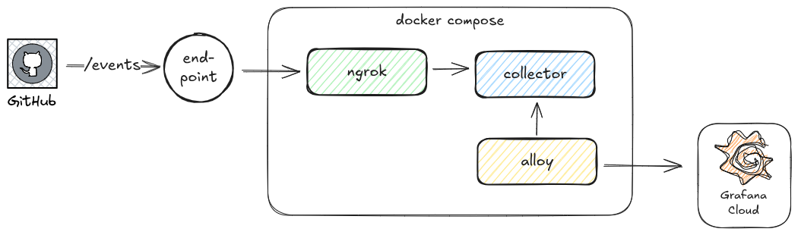
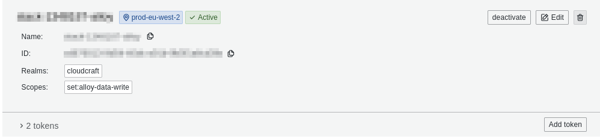

# Prometheus GH Collector

Minimal example showing how to export a Prometheus counter from events collected by a GitHub webhook

## Build

```
make build
```

## Usage

```
./bin/prometheus-gha-collector --repo example/sample-app
```

This starts an HTTP server on port 9101. Metrics are available at `http://localhost:9101/metrics`.

Testing endpoints:

- `POST /events`: Send an example deployment event payload

```sh
curl -v -XPOST -H "X-GitHub-Event:deployment" -d '{"action":"created", "deployment":{"environment":"deployment","id": 123}}' localhost:9101/events
```

- `GET /metrics`: Get the metrics produced so far

```sh
curl localhost:9101/metrics | grep gha
```

## Docker Compose

Docker compose can be used for end-to-end testing. It will bring up a stack of this collector, an instance of Alloy to scrape metrics and a publicly routable endpoint for webhooks using [ngrok](https://ngrok.com/):



Preconditions:

- Instances of Mimir and Loki to receive logs and metrics. A free tier [Grafana Cloud](https://grafana.com/products/cloud/) account can provide the necessary
- Free ngrok account to receive webhook events from GitHub

Create a `.env` file with the following contents:

```
MIMIR_HOST: <GCLOUD_HOSTED_METRICS_URL>
MIMIR_BASIC_AUTH_USER: <GCLOUD_HOSTED_METRICS_ID>
LOKI_HOST: <GCLOUD_HOSTED_LOGS_URL>
LOKI_BASIC_AUTH_USER: <GCLOUD_HOSTED_LOGS_ID>
GCLOUD_API_KEY: <GCLOUD_API_KEY>
NGROK_AUTHTOKEN: <NGROK_AUTHTOKEN>
```

NB: To generate the `GCLOUD_API_KEY`, create a [Grafana Cloud Access policy](https://grafana.com/docs/grafana-cloud/security-and-account-management/authentication-and-permissions/access-policies/) with `set:alloy-data-write` scope:



```sh
docker-compose up --build
```

To test:

- Use the endpoint URL displayed by `ngrok` on start as a webhook in a Git repo
- Alternatively, use the included [example events](./examples):

```sh
curl -v -XPOST -H "X-GitHub-Event:deployment" -d @examples/deployment.json localhost:9101/events
```
